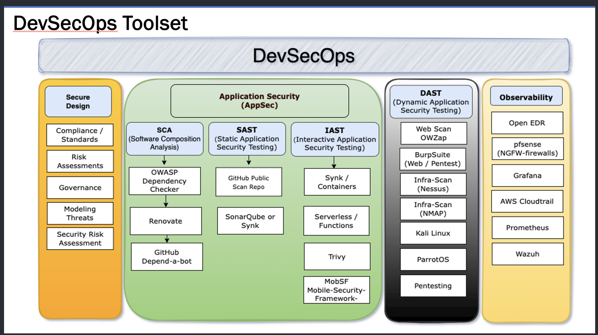

# **CyberSecurity Ethical Hacker Lessons**

Load up a hypervisor; Hyper-V on win10/11 or VMware Workstation or VMware fusion.   I prefer these two as well as Virtualbox is an option

 1 - Setup Ubuntu Server

 2 - Setup FreeBSD (using pre-config hard
drive)

 3 - Install and get Docker or Podman working / hosting on Ubuntu Server

 4 - Download from github and install DVWA vulnerable app and run within docker container

 5 - Install Web tools, browse DVWA running incontainer

 6 - Find Metasploitable 2 or 3 setup in hypervisor

 7 - Setup Kali Linux VM

# DevSecOps Toolset by Capability

[DevSecOps Image](https://github.com/steveschofield/build-beginner-ethical-hacking-environment/blob/main/cybersecurity-mentoring-notes/image/README/1740086647034.png "Open Source tools")

# **My Github repo**

[https://github.com/steveschofield/build-beginner-ethical-hacking-environment](https://github.com/steveschofield/build-beginner-ethical-hacking-environment)

# **My YouTube playlist**

[https://www.youtube.com/watch?v=DOHsK1p25Ew&amp;list=PLTfslD-MgbHeKdfJN01rONNXmHCfRsVzS&amp;pp=gAQB](https://www.youtube.com/watch?v=DOHsK1p25Ew&list=PLTfslD-MgbHeKdfJN01rONNXmHCfRsVzS&pp=gAQB)

# **Articles**

**So You Want To Work in Cyber Security?**

Loooong article - probably one of the best I've seen - [https://jhalon.github.io/breaking-into-cyber-security/](https://jhalon.github.io/breaking-into-cyber-security/)

# Certifications

**CompTIA**
(big three)

**A+ > Network+ > Security** + by **Comptia** good start
(would recommend items listed above for practice)

[https://https://www.professormesser.com/](https://www.professormesser.com/) (free content on YouTube for all three)
