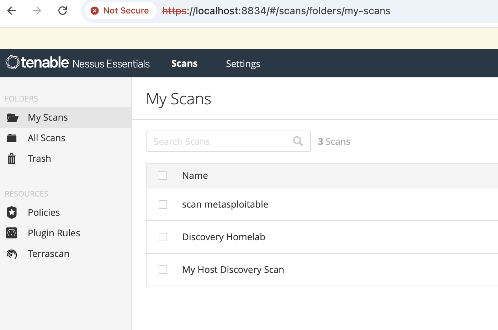
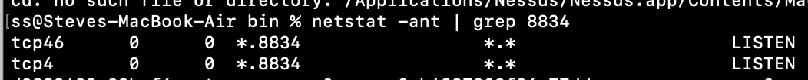

# Run network scans on *[your]()* "Localhost" *(will help keep you out of prison)*

How to setup your machine to learn network vulnerability scanning, locally.  **Nessus** is an industry standard for vulnerability scanners.   **Tenable**, makers of Nessus provide a 16 ip addresses option.  Nessus Essentials can be used to scan machines on your local machine (aka Localhost).   Metasploitable2/3 are ***perfect*** machines to learn how to scan for vulnerabilities and perform active recon.  Once you setup your Metasploitable instance, scan with both Nessus Essentials or [NMAP](https://nmap.org)

## [Download Nessus Essentials ](https://www.tenable.com/products/nessus/nessus-essentials)

## Install Metasploitable 2 / 3

For **MacBook** -[ reference article](run-metasploitable-on-macbook-m-series.md) in **Cybersecurity-mentoring-notes** covering how to use **UTM** hypervisor.  UTM has a feature to Emulate x86/64 on MacBook M-series.  If you have a Windows x86/64 machine, you'll be able to use VMware workstation, Hyper-V or VirtualBox as your hypervisor to run the Metasploitiable 2/3

# Reference article for Metasploitable

[https://docs.rapid7.com/metasploit/metasploitable-2-exploitability-guide](https://docs.rapid7.com/metasploit/metasploitable-2-exploitability-guide)

# Screenshot of Nessus Essentials (scan metasploitable)

# 
TCP listener

