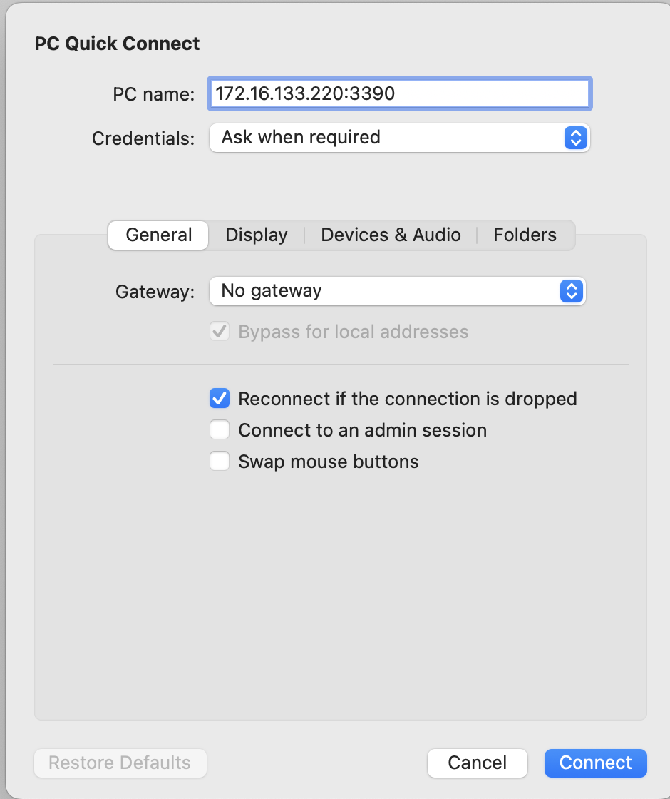
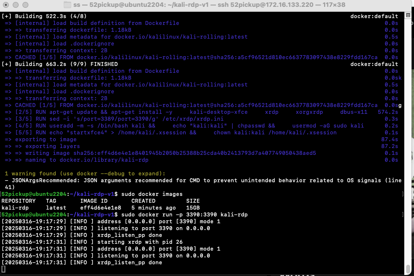
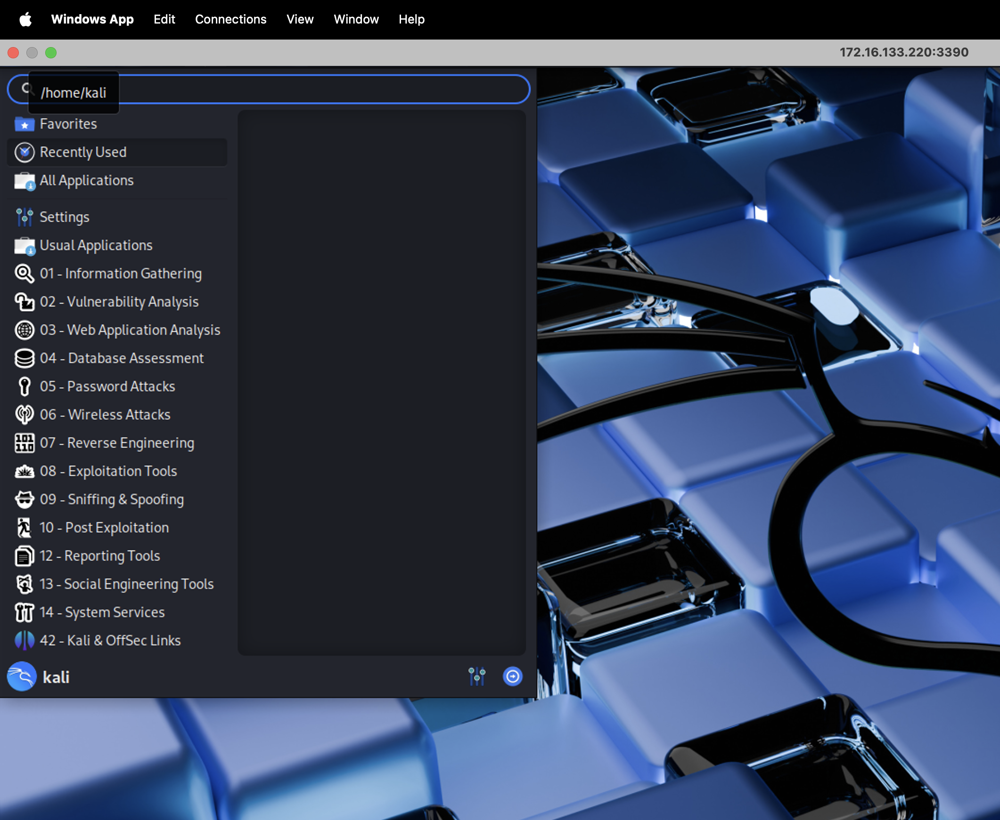
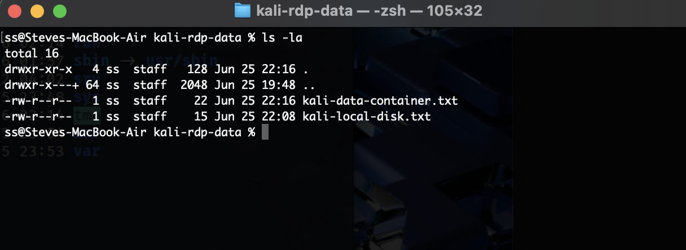
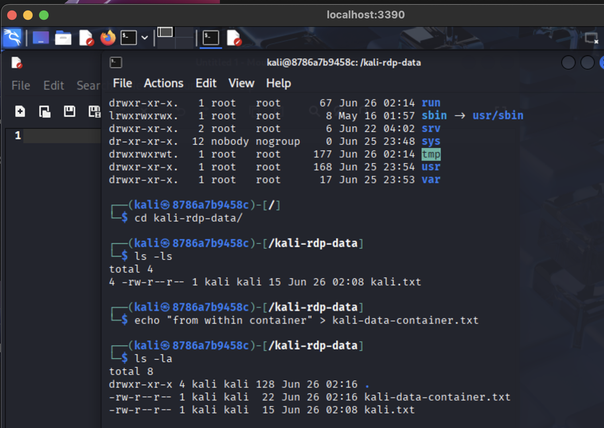

# Create Kali docker or podman image

Using a container with a functional Kali instance is easier than using a local hypervisor such as vmware, virtualbox, hyper-v and make available on MacBook, Windows or Linux.   Each solution either physical, virtual machine, virtualization or vagrat along with containers.  There are options.  I used port 3390 but you can also use 3389 (standard rdp port)

## Build container

Type :

* **podman build -t kali-rdp .**
* **sudo docker build -t kali-rdp .**

To install & configure podman on MacBook - [https://podman.io/docs/installation](https://podman.io/docs/installation)

To install & configure Docker on Ubuntu -[ https://docs.docker.com/engine/install/ubuntu/](https://docs.docker.com/engine/install/ubuntu/)

**NOTE:** You can run docker on MacBook, it requires Docker Desktop and is free for personal use (as of March 2025)

[https://www.docker.com/products/personal/](https://www.docker.com/products/personal/)

## Run container

* **sudo docker run -p 3390:3390 kali-rdp**

**
    I run podman on my local Mac and need to add the --privilieged flag to get nmap to work within the container**

* **sudo podman run --privileged -d -p 3390:3390 localhost/kali-rdp**

## If you want Persisent Storage 

Install Podman CLI on mac from [podman.io](http://podman.io/)

**#make folder where data will reside on local system**

* mkdir ~/kali-rdp-data

**#this will create a mount inside the VM**
**#run podman machine ssh to view**

* podman machine init --volume /Users/$(whoami)/kali-rdp-data:/kali-rdp-data
* podman machine start

**#download source code and build kali-rdp container**

* mkdir -p ~/code/personal
* cd ~/code/personal
* git clone [https://github.com/steveschofield/build-beginner-ethical-hacking-environment](https://github.com/steveschofield/build-beginner-ethical-hacking-environment)
* cd ~/code/personal/build-beginner-ethical-hacking-environment/environments/containers/kali-rdp
* podman build -t kali-rdp .

**#should be tagged**

*Successfully tagged localhost/kali-rdp:latest*

**#Verify container is built**

* podman images

REPOSITORY                        TAG         IMAGE ID      CREATED       SIZE

localhost/kali-rdp                latest      d6e774facea6  14 hours ago  15.4 GB
[docker.io/kalilinux/kali-rolling](http://docker.io/kalilinux/kali-rolling)  latest      8759ea0e0ae1  3 days ago    149 MB

**#run the container and mount --volume**

* podman run -d -p 3390:3390 --privileged --volume /kali-rdp-data:/kali-rdp-data localhost/kali-rdp

## References

* [https://www.kali.org/docs/containers/official-kalilinux-docker-images/](https://www.kali.org/docs/containers/official-kalilinux-docker-images/)
* I tried this kali-linux image [https://docs.linuxserver.io/images/docker-kali-linux/](https://docs.linuxserver.io/images/docker-kali-linux/). Good to know for future reference and my rdesktop example uses the container image from this site.
* [https://grok.com](https://grok.com) ( to help with order, syntax and peer guidance )

**Persistence**

