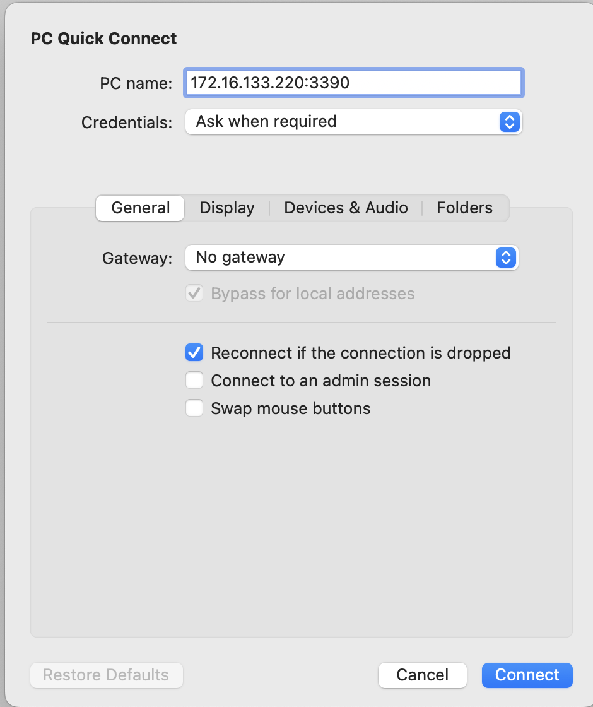

# Create Kali docker or podman image

Using a container with a functional Kali instance is easier than using a local hypervisor such as vmware, virtualbox, hyper-v and make available on MacBook, Windows or Linux.   Each solution either physical, virtual machine, virtualization or vagrat along with containers.  There are options.  I used port 3390 but you can also use 3389 (standard rdp port)

## To:do

Persistenc changes of container to last reboots / restarts.

## Build container

Type :

* **podman build -t kali-rdp .**
* **sudo docker build -t kali-rdp .**

To install & configure podman on MacBook - [https://podman.io/docs/installation](https://podman.io/docs/installation)

To install & configure Docker on Ubuntu -[ https://docs.docker.com/engine/install/ubuntu/](https://docs.docker.com/engine/install/ubuntu/)

**NOTE:** You can run docker on MacBook, it requires Docker Desktop and is free for personal use (as of March 2025)

[https://www.docker.com/products/personal/](https://www.docker.com/products/personal/)

## Run container

* **sudo docker run -p 3390:3390 kali-rdp**

## References

* [https://www.kali.org/docs/containers/official-kalilinux-docker-images/](https://www.kali.org/docs/containers/official-kalilinux-docker-images/)
* I tried this kali-linux image [https://docs.linuxserver.io/images/docker-kali-linux/](https://docs.linuxserver.io/images/docker-kali-linux/). Good to know for future reference and my rdesktop example uses the container image from this site.
* [https://grok.com](https://grok.com) ( to help with order, syntax and peer guidance )

