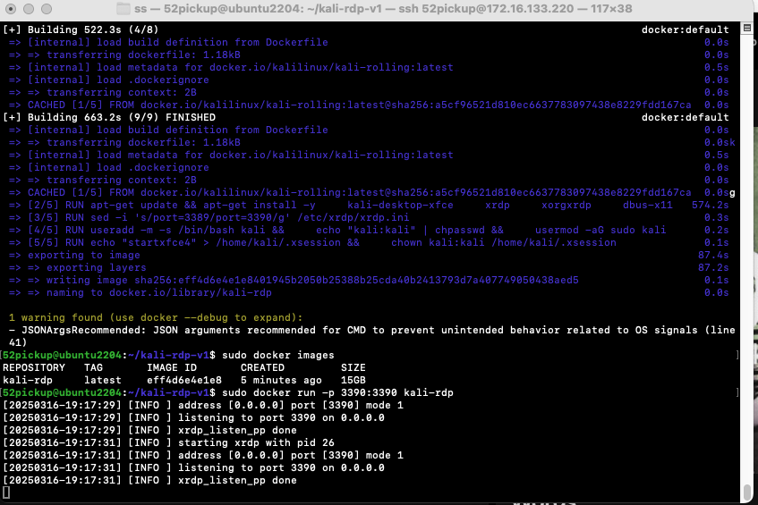

# Create kali docker or podman image

Don't need a local hypervisor such as vmware, virtualbox or hyper-v

## Build container

type 

podman build -t kali-rdp .

or 

sudo docker build -t kali-rdp .

to run

sudo docker run -p 3390:3390 kali-rdp

