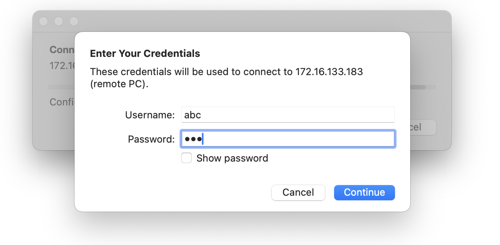
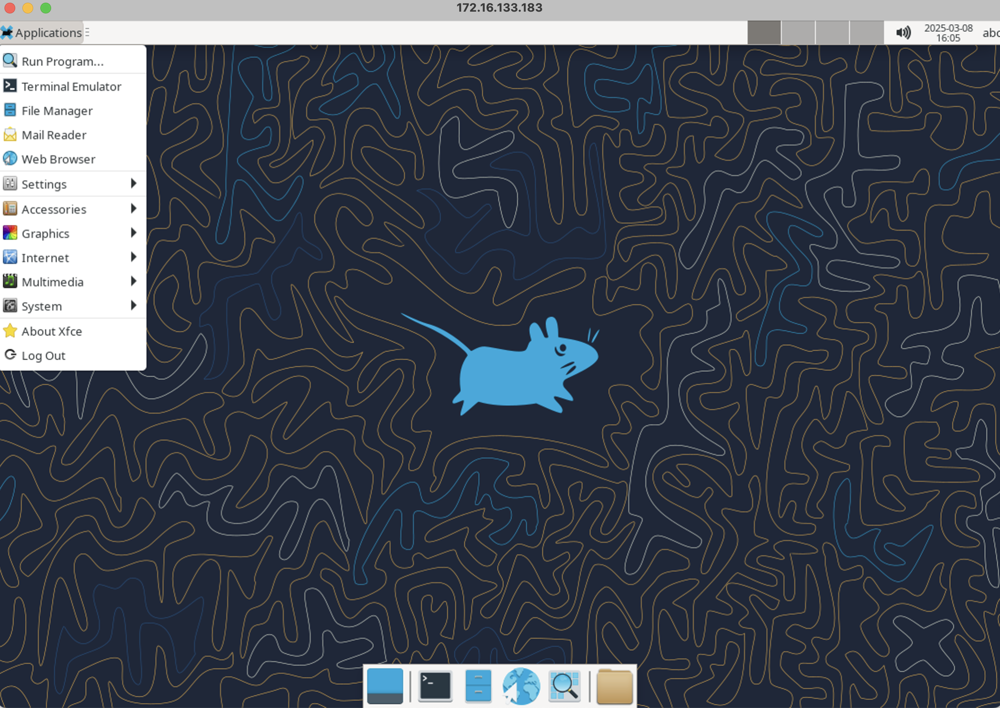

# Build and deploy container able to RDP (remote desktop protocol)

I learned from [https://github.com/OWASP/wrongsecrets](https://github.com/OWASP/wrongsecrets) repo ability to deploy a container and RDP from a machine.  The wrongsecrets repo / containers are built into the

This Dockerfile deploys a container image and exposes port 3389 (Microsoft Remote desktop protocol).  The container uses the **rdesktop** image from [linuxserver.io](https://docs.linuxserver.io/images/docker-rdesktop/)

The base virtual machine is an ubuntu s[erver used is build from a Vagrant file here](MacBook-M-Series-vagrant-ubuntu-2204)

# YouTube Video

[https://www.youtube.com/watch?v=z8WNsICtIIs](https://www.youtube.com/watch?v=z8WNsICtIIs)

# Assumptions:

* Have a windows or macbook with vmware fusion or hyper-v installed and configured
* Vagrant providers for vmware_desktop or hyperv deployed on respective machine on MacBook or Windows machine

# Commands

ssh 52pickup@172.16.133.183

# **Pulled down repo**

git clone [https://github.com/steveschofield/build-beginner-ethical-hacking-environment](https://github.com/steveschofield/build-beginner-ethical-hacking-environment)

cd rdesktop-container

# **Build the local container**

sudo docker build -t basic-desktop .

# **Here is the output**

```
b
```

# **Deploy container for testing**

Here is the output including command to launch

**sudo docker run -p 3389:3389 basic-desktop**
[migrations] started
[migrations] no migrations found
usermod: no changes
───────────────────────────────────────

    ██╗     ███████╗██╗ ██████╗
      ██║     ██╔════╝██║██╔═══██╗
      ██║     ███████╗██║██║   ██║
      ██║     ╚════██║██║██║   ██║
      ███████╗███████║██║╚██████╔╝
      ╚══════╝╚══════╝╚═╝ ╚═════╝

   Brought to you by linuxserver.io
───────────────────────────────────────

To support LSIO projects visit:
https://www.linuxserver.io/donate/

───────────────────────────────────────
GID/UID
───────────────────────────────────────

User UID:    911
User GID:    911
───────────────────────────────────────
Linuxserver.io version: 55d78481-ls248
Build-date: 2025-03-02T23:40:47+00:00
───────────────────────────────────────

Generating 2048 bit rsa key...

ssl_gen_key_xrdp1 ok

saving to rsakeys.ini

..........+......+.....+....+..+......+.......+++++++++++++++++++++++++++++++++++++++*...................+....+..+...+.+..+....+...+.....+++++++++++++++++++++++++++++++++++++++*..........+.+............+...........+.+...........+...+.........................+..+...................+...+.................+.+..+...+.......+......+............+..+.+.....+.+......+...+............+..+.+..+.........................+...+...........+..........+...+......+.....+.........+.+..++++++
..+..................+..+...+...+.............+.....+.......+..+.......+...+...........+.+........+...+...+.......+..+...+...+.......+...+.....+.......+...+.........+..+++++++++++++++++++++++++++++++++++++++*...+....+.....+++++++++++++++++++++++++++++++++++++++*.......+...........+..........+..+...............+.+.........+...+........+....+...+........+....+.....+.......+...+.....+.+.....+.+.........+..+....+.....+.+...+...........+..........+...+..+......+.........+.+............+..+.+.....+.............+............+..+.+..+....+.....................+..+......+.........+......+.+..................+.....+.+..+.......+.....+.............+........+.........+.......+...............+.....+......+...+....+...+.....+...+....+..+...+...+.......+......+.....+.........+...+.......+...........+.+........+.+.....+......+.+........+...............+.......+...+......+.....+..................+.+......+...+..+.+..+.......+......+..+.............+............+...............+.................+...+.+............+...+.....+.+.........+......+........+...+.......+...............+......+..+..........+.....+.........+...+...+....+...+...+..+......+.+.....+...+..................+....+...++++++
-------------------------------------------------------------------------------------------------------------------------------------------------------------------------------------------------------------------------------------------------------------------------------------------------------------------------------------------------------------------------------------------------------------------------------------------------------------------------------------------------------------------------------------------------------------------------------------------------------------------------------------------------------------------------------------------------------------------------------------------------------------------------------------------------------------------------------------------------------------------------------------------------------------------------------------------------------------------------------------------------------------------------------------------------------------------------------------------------------------------------------------------------------------------------------------------------------------------------------------

[custom-init] No custom files found, skipping...
Connection to localhost (::1) 3350 port [tcp/*] succeeded!
Connection to localhost (::1) 3389 port [tcp/ms-wbt-server] succeeded!
[ls.io-init] done.`

# From a MacBook or Windows, use the RDP client

the default user is abc/abc and recommendation to update if you plan to use.  This is for education purposes to show what can be done.  I plan to use the container for variety of ethical hacking.




